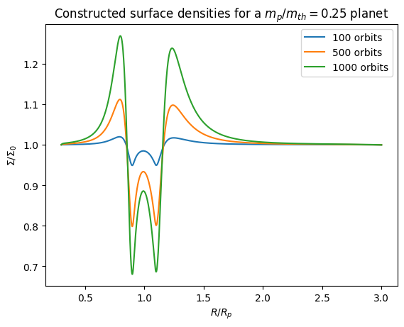

# Vortensity Driven Evolution of Protoplanetary Disks

This repository implements the methods of CR21 and CR23 to track the 
surface density evolution of a protoplanetary disk through modeling
the change in vortensity due to a shock. 

The 1D axisymmetric surface density of the protoplanetary disk can 
be generated within seconds and provides a good fit (especially in
the outer disk) to the evolution of the disk.

`vortensity_k` contains a python implementation with `example.ipynb`
showing how to use it, and `vortensity_matlab/` contains a matlab
implementation. Running the python implementation requires matplotlib, 
numpy and scipy to be installed. The matlab implementation works 
with base matlab.

These both also contain a way of calculating $K(R) \equiv \partial F/\partial R \Sigma^{-1}$
the use of which will be discussed in a forthcoming paper.

Please note that these versions have similar looking but DIFFERENT
commands to call each of the functions (and a slightly
different implementation of the r to $\tau$ transformation).

## Example Output

## Implementation Description
CR21 generated a semi-analytical formula for the size of the shock
generated by a sub thermal mass planet in a globally isothermal disk.
They then used this to describe the linear evolution in vortensity $\zeta$ 
defined as $\zeta = $. CR23 extended this to reconstruct the surface 
density of a disk from its vortensity.

A forthcoming work rewrites this evolution in terms of the more 
standard angular momentum flux $F$ and includes viscous effects.

## Changes from the published papers
This repository includes an adjustment of $2 \pi$ multiplied to
$\Delta \zeta$. This was an error in the original paper due to a
mistaken normalisation, the evidence for this shift is shown in 
the python notebook example and a correction from the original 
authors is forthcoming.

## Use in further work
These codes may be freely distributed and modified as long as 
credit to the author (Amelia Cordwell) remains. Any use 
in a scientific publication should cite both this repository, CR21
and CR23.

## Referenced papers
CR21 - https://arxiv.org/abs/2108.01423
CR23 - https://arxiv.org/abs/2212.03062
